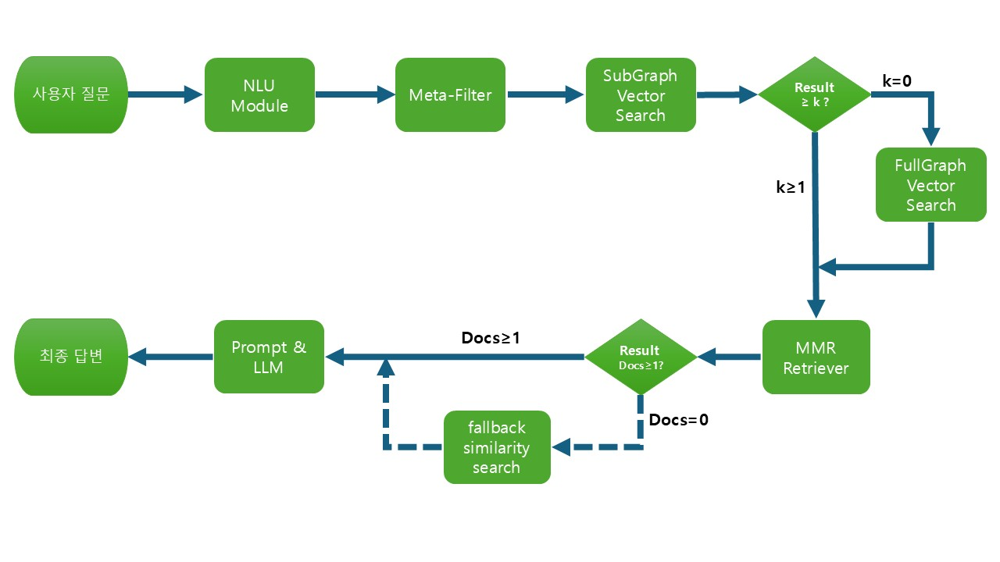

# Korea YouthPolicy Chatbot

**전국 청년 정책을 한눈에! Graph-RAG 기반의 청년 정책 통합 검색 챗봇**

---

## 프로젝트 개요

기존의 청년 정책 정보는 지역별, 기관별로 파편화되어 있어 필요한 정책을 찾기 어렵습니다. 본 프로젝트는 전국 모든 청년 정책 정보를 **Graph-RAG** 기술을 통해 통합 검색할 수 있는 챗봇을 제공합니다. 사용자는 지역, 나이, 키워드 등 다양한 조건으로 질문할 수 있고, 필요한 정책 정보를 정확하게 얻을 수 있습니다.

---

## 프로젝트 주요 목표

* 전국의 다양한 청년 정책을 **통합 및 구조화**
* 자연어 기반의 **정확하고 빠른 정책 검색**
* 사용자 친화적인 인터페이스 제공
* Graph 기반의 효율적인 **정책 추천 및 확장**

---
## 시스템 아키텍처


---
## 주요 기술 및 구조

본 프로젝트는 다음과 같은 고급 기술들을 활용하여 구현되었습니다:

### 📌 Retrieval-Augmented Generation (RAG)

* **Hybrid Retriever**: 메타 데이터 필터링과 벡터 유사도 기반의 MMR(Maximal Marginal Relevance) 검색 기법을 결합
* **Semantic Chunker**: 의미 기반의 청크 분할로 검색 성능 향상
* **임베딩 모델**: `intfloat/multilingual-e5-large`를 활용하여 고성능 임베딩 생성

### 📌 Graph 기반 검색

* **NetworkX**를 활용한 정책 간 관계 그래프 생성 및 분석
* **Full-Graph/Sub-Graph** 전략을 통해 그래프 구조를 세분화하고 빠른 검색 성능 달성

### 📌 언어모델 (LLM)

* Google Gemini API (**gemini-2.0-flash**) 활용하여 테스트하였습니다. (GPT, Claude, Opensource LLM 등 코드 수정을 통해 다양하게 활용 가능.)
* 체계적인 Prompt Engineering으로 정확한 응답 생성

### 📌 인터페이스 및 서버

* **Gradio** 기반 사용자 인터페이스 제공

---

## 🗂️ 프로젝트 디렉토리 구조

```
Korea-YouthPolicy-Chatbot/
├─ embedding/
│  ├─ __init__.py
│  ├─ embed_run.py
│  ├─ json_to_docs.py
│  ├─ fullgraph/
│  │   └─ build_graph.py
│  └─ subgraph/
│      └─ build_subgraph.py
│
├─ chatbot/
│  ├─ __init__.py
│  ├─ retrieval.py
│  ├─ llm_chain.py
│  └─ server.py
│
├─ data/
│  └─ YouthPolicy_data.json
│
├─ main.py
├─ requirements.txt
└─ README.md
```

---

## ⚙️ 프로젝트 실행 방법

### 환경 설정

```bash
pip install -r requirements.txt
```

### 임베딩 생성

```bash
python -m embedding.embed_run
```

### 챗봇 서버 실행

```bash
python main.py
```

---

## 📞 문의

[LinkedIn](www.linkedin.com/in/raheun-g-1066171b8)
---

**감사합니다! 😊**
